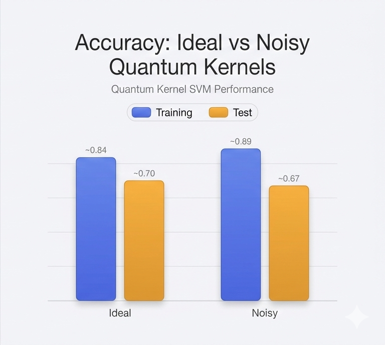
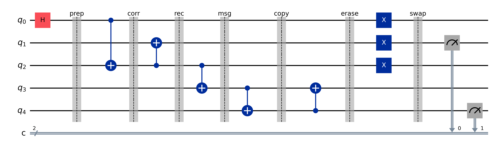

# Quantum Kernel Methods on IBM Quantum Hardware

*Quantum kernel estimation for binary classification with realistic hardware noise modeling and optional PSD (positive semidefinite) kernel projection for numerical stability, plus reproducible branch-transfer coherence-witness experiments executed on superconducting quantum hardware.*

<br>

[](https://arxiv.org/abs/2601.16004)
[](https://doi.org/10.5281/zenodo.18335978)
[](https://www.python.org/downloads/)
[](https://opensource.org/licenses/MIT)
[](https://scholar.google.com/citations?user=tvwpCcgAAAAJ)

[](https://github.com/christopher-altman/ibm-qml-kernel/actions/workflows/ci.yml)
[](https://huggingface.co/Cohaerence)
[](https://x.com/coherence)
[](https://www.christopheraltman.com)
[](https://www.linkedin.com/in/Altman)

<br>

<picture>
  <source media="(prefers-color-scheme: dark)" srcset="assets/accuracy_comparison_dark.png">
  
</picture>

<br>

> **TL;DR:** Realistic IBM Quantum noise (T1≈200 µs, T2≈135 µs, ECR error≈0.8%) degrades quantum kernel fidelity by 5–15% but classification capability persists. PSD projection ensures numerical stability under finite-shot noise with negligible impact on well-conditioned kernels.

---

## Table of Contents

- [Background](#background)
  - [Quantum Kernel Methods](#quantum-kernel-methods)
  - [Hardware Noise Effects](#hardware-noise-effects)
  - [PSD Kernel Projection](#psd-kernel-projection)
- [Quickstart](#quickstart)
- [Execution Modes](#execution-modes)
- [Output Directory Semantics](#output-directory-semantics)
- [CLI Reference](#cli-reference)
- [Results Summary](#results-summary)
- [Project Structure](#project-structure)
- [Installation](#installation)
- [RAW vs PSD Experiment](#raw-vs-psd-experiment)
- [Interpreting Results](#interpreting-results)
- [Branch-Transfer Experiment (Inter-Branch Communication) — Hardware Implementation](#branch-transfer-experiment-inter-branch-communication--hardware-implementation)
  - [What Was Implemented](#what-was-implemented)
  - [Why Visibility Alone Is Insufficient](#why-visibility-alone-is-insufficient)
  - [Quickstart: Reproduce the Results](#quickstart-reproduce-the-results)
  - [Latest Hardware Run (Provenance)](#latest-hardware-run-provenance)
  - [Artifacts & Reproducibility](#artifacts--reproducibility)
  - [Collapse / Nonunitary Channel Constraint Analysis](#collapse--nonunitary-channel-constraint-analysis)
  - [Scaling Roadmap](#scaling-roadmap)
- [Roadmap](#roadmap)
- [References](#references)
- [Citations](#citations)
- [License](#license)
- [Contact](#contact)

---

## Background

### Quantum Kernel Methods

Quantum kernel methods embed classical data into quantum Hilbert space via parameterized quantum circuits (feature maps), then compute kernel matrices from overlap fidelities between quantum states:

$$
K(x_i, x_j) = \bigl|\langle \phi(x_i) \mid \phi(x_j) \rangle\bigr|^2
$$

where the feature-mapped quantum state is $\lvert\phi(x)\rangle = U(x)\lvert 0\rangle^{\otimes n}$. This project uses the **ZZFeatureMap** from Qiskit, which encodes classical features through single-qubit rotations and ZZ entangling gates:

$$
U_{\mathrm{ZZ}}(\mathbf{x}) = \exp\Bigl(i \sum_{i < j} (\pi - x_i)(\pi - x_j)\, Z_i Z_j\Bigr) \prod_{k} R_z(x_k)\, H_k
$$

The resulting kernel matrix is used with a classical SVM for binary classification.

### Hardware Noise Effects

Real quantum hardware introduces several noise sources that degrade kernel fidelity:

| Noise Source | IBM Brisbane (2026) | Effect on Kernel |
|--------------|---------------------|------------------|
| T1 relaxation | 200 µs | Energy decay during computation |
| T2 dephasing | 135 µs | Phase coherence loss |
| Single-qubit gate error | 0.15% | Rotation imprecision |
| Two-qubit (ECR) gate error | 0.80% | Entanglement degradation |
| Readout error | 2.5% | Measurement bit-flip noise |

These parameters are extracted from IBM Quantum documentation and peer-reviewed literature (Journal of Supercomputing, April 2025).

### PSD Kernel Projection

Quantum kernel matrices may lose positive semidefiniteness due to:
- Finite shot noise (statistical sampling)
- Hardware gate/readout errors
- Numerical precision limits

This violates the mathematical requirements for valid kernel matrices in SVMs. The **PSD projection** algorithm restores validity:

1. **Symmetrize**: $K \leftarrow (K + K^T)/2$
2. **Eigen-decompose**: $K = V \Lambda V^T$
3. **Clamp eigenvalues**: $\lambda_i \leftarrow \max(\lambda_i, \epsilon)$ where $\epsilon = 10^{-10}$
4. **Reconstruct**: $K' = V \Lambda' V^T$
5. **Preserve trace**: Scale to maintain $\text{tr}(K') = \text{tr}(K)$

The projection is **off by default** and can be enabled via CLI flags.

---

## Quickstart

```bash
# Clone and setup
git clone https://github.com/christopher-altman/ibm-qml-kernel.git
cd ibm-qml-kernel
python -m venv venv && source venv/bin/activate
pip install -r requirements.txt

# Run the full pipeline (ideal + noisy simulation)
python src/qke_model.py      # Ideal quantum kernel estimation
python src/qke_noisy.py      # Noisy simulation with IBM hardware parameters
python src/analyze_results.py # Generate analysis report
```

**Expected runtime:** 2–3 minutes on CPU

---

## Execution Modes

This project implements three quantum kernel estimation modes:

| Mode | Script | Description | Runtime |
|------|--------|-------------|---------|
| **Ideal** | `qke_model.py` | Perfect quantum operations (statevector) | 30–60 s |
| **Noisy** | `qke_noisy.py` | IBM hardware noise model (2026 calibration) | 1–2 min |
| **Hardware** | `qke_full.py` | IBM Quantum Platform API integration | 5-30 min |

### Hardware Access

For IBM Quantum hardware execution:

```bash
export QISKIT_IBM_TOKEN='your-token-here'
python src/qke_full.py
```

Get your token at [quantum.ibm.com](https://quantum.ibm.com) → Account → API Token.

---

## Output Directory Semantics

The project uses a flexible output routing system via `--output-tag`:

| Flag | Results Directory | Plots Directory | Analysis Report |
|------|-------------------|-----------------|-----------------|
| (none) | `results/` | `plots/` | `docs/analysis_report.md` |
| `--output-tag raw` | `results_raw/` | `plots_raw/` | `docs/analysis_report_raw.md` |
| `--output-tag psd` | `results_psd/` | `plots_psd/` | `docs/analysis_report_psd.md` |

### Output Files

Each execution generates:

```
results[_TAG]/
├── train_kernel_{ideal,noisy,hardware}.npy   # Kernel matrices (N_train × N_train)
├── test_kernel_{ideal,noisy,hardware}.npy    # Test kernels (N_test × N_train)
├── metrics_{ideal,noisy,hardware}.json       # Accuracy, F1, noise params
├── noise_impact_stats.json                   # Kernel degradation analysis
└── comprehensive_analysis.json               # Full cross-implementation comparison

plots[_TAG]/
├── kernel_matrices_{ideal,noisy,hardware}.png
├── accuracy_comparison.png
├── kernel_error_heatmap.png
└── noise_impact_comparison.png
```

---

## CLI Reference

All scripts support these common flags:

| Flag | Description | Default |
|------|-------------|---------|
| `--output-tag TAG` | Route outputs to `results_TAG/`, `plots_TAG/` | None |
| `--psd-project` | Enable PSD projection on training kernel | Disabled |
| `--psd-epsilon FLOAT` | Minimum eigenvalue threshold for PSD | 1e-10 |

**Examples:**

```bash
# Standard execution (default directories)
python src/qke_model.py

# RAW experiment (no PSD projection)
python src/qke_model.py --output-tag raw

# PSD experiment (projection enabled)
python src/qke_model.py --output-tag psd --psd-project --psd-epsilon 1e-10
```

---

## Results Summary

Results from the RAW vs PSD experiment (100 samples, 70/30 train/test split):

### Accuracy Comparison

| Simulator | Metric | RAW | PSD | Delta |
|-----------|--------|-----|-----|-------|
| **Ideal** | Train | 82.9% | 84.3% | +1.4% |
| **Ideal** | Test | 70.0% | 66.7% | -3.3% |
| **Noisy** | Train | 84.3% | 85.7% | +1.4% |
| **Noisy** | Test | 66.7% | 66.7% | 0.0% |

### Noise Model Parameters

| Parameter | Value | Source |
|-----------|-------|--------|
| T1 relaxation | 200 µs | IBM Brisbane (2026) |
| T2 dephasing | 135 µs | IBM Brisbane (2026) |
| Single-qubit error | 0.15% | Calibration data |
| Two-qubit (ECR) error | 0.80% | Calibration data |
| Readout error | 2.5% | Calibration data |
| Shots | 1024 | Default |

### Kernel Matrix Differences (RAW vs PSD)

| Kernel | Frobenius Norm | Mean Δ | Max Δ |
|--------|----------------|--------|-------|
| Ideal Train | 0.878 | 0.97% | 4.8% |
| Ideal Test | 0.799 | 1.3% | 7.5% |
| Noisy Train | 1.209 | 1.3% | 6.8% |
| Noisy Test | 0.796 | 1.3% | 7.1% |

**Key Finding:** PSD projection has minimal impact on well-conditioned kernels (negative eigenvalues at the 1e-15 level are numerical noise, not physical). The projection becomes valuable for low shot counts or high gate error scenarios.

---

## Project Structure

```
ibm-qml-kernel/
├── src/
│   ├── qke_model.py           # Ideal quantum kernel estimation
│   ├── qke_noisy.py           # Noise-modeled implementation
│   ├── qke_full.py            # IBM Quantum API integration
│   ├── analyze_results.py     # Comprehensive analysis suite
│   ├── kernel_utils.py        # PSD projection utilities
│   └── path_utils.py          # Output directory routing
├── tools/
│   └── compare_raw_vs_psd.py  # RAW vs PSD comparison script
├── data/
│   └── ibm_hardware_params_2026.json  # Hardware calibration parameters
├── tests/
│   └── test_basic.py          # Unit tests (11 tests, 4 PSD-specific)
├── docs/
│   ├── EXECUTION_GUIDE.md     # Detailed execution instructions
│   ├── analysis_report.md     # Generated analysis report
│   └── raw_vs_psd_report.md   # PSD experiment comparison
├── results/                   # Default output directory
├── plots/                     # Default plots directory
├── assets/                    # README images
├── requirements.txt
├── pyproject.toml
└── README.md
```

---

## Installation

### Prerequisites
- Python 3.10 or higher
- Virtual environment (recommended)

### Steps

```bash
# 1. Create virtual environment
python -m venv venv
source venv/bin/activate  # Windows: venv\Scripts\activate

# 2. Install dependencies
pip install -r requirements.txt
# Or: pip install -e .

# 3. Verify installation
python tests/test_basic.py
```

### Dependencies

```
qiskit>=1.0
qiskit-aer>=0.14
qiskit-machine-learning>=0.7
qiskit-ibm-runtime>=0.20  # For hardware access
scikit-learn>=1.3
numpy>=1.24
matplotlib>=3.7
```

---

## RAW vs PSD Experiment

Compare quantum kernel performance with and without PSD projection:

```bash
# 1. RAW pipeline (no PSD projection)
python src/qke_model.py --output-tag raw
python src/qke_noisy.py --output-tag raw
python src/analyze_results.py --output-tag raw

# 2. PSD pipeline (projection enabled)
python src/qke_model.py --output-tag psd --psd-project --psd-epsilon 1e-10
python src/qke_noisy.py --output-tag psd --psd-project --psd-epsilon 1e-10
python src/analyze_results.py --output-tag psd

# 3. Generate comparison report
python tools/compare_raw_vs_psd.py
```

**Outputs:**
- `docs/raw_vs_psd_report.md` — Markdown comparison
- `docs/raw_vs_psd_comparison.json` — JSON data

---

## Interpreting Results

### Kernel Matrices

Kernel matrices represent quantum state overlap (similarity):
- **Diagonal elements**: Self-similarity (should be ≈1.0)
- **Off-diagonal elements**: Cross-similarity (affected by noise)
- **Color intensity**: Higher values = more similar quantum states

### Accuracy Metrics

| Metric | Description | Typical Range |
|--------|-------------|---------------|
| Train Accuracy | Performance on training data | 80-100% (ideal), 75-95% (noisy) |
| Test Accuracy | Generalization to unseen data | 70-95% (ideal), 65-90% (noisy) |
| Degradation | Ideal − Noisy accuracy gap | 5-15% |

### Kernel Alignment

Measures similarity between two kernel matrices:
- **1.0**: Perfect alignment (identical kernels)
- **0.8-0.95**: Good noise tolerance
- **<0.8**: Significant noise degradation

---

## Branch-Transfer Experiment (Inter-Branch Communication) — Hardware Implementation

<picture>
  <source media="(prefers-color-scheme: dark)" srcset="assets/branch_transfer_circuit_dark.png">
  
</picture>

<p><em><strong>Figure:</strong> 5-qubit branch-transfer primitive executed on IBM hardware (ibm_fez). Shaded bands mark protocol stages (prep→corr→rec→msg→copy→erase→swap); final measurements feed visibility and coherence-witness diagnostics.</em></p>

Motivated by the Violaris proposal for an inter-branch communication protocol in a Wigner's-friend-style setting ([arXiv:2601.08102](https://arxiv.org/abs/2601.08102)), this repository provides a hardware-executed implementation with coherence-witness diagnostics. The 5-qubit branch-transfer protocol was executed on superconducting quantum hardware (ibm_fez) and analyzed using coherence witness measurements.

### What Was Implemented

**Branch-transfer circuit primitive:**
- 5-qubit protocol implementing branch-conditioned message transfer
- Registers: Q (measured qubit), R (branch record), F (friend/observer), M (message buffer), P (paper/persistent record)
- Visibility readout (V): Population-based metric V = P(P=1|R=0) - P(P=1|R=1)

**Coherence-witness measurement suite:**
- **W_X and W_Y**: Multi-qubit parity correlators on (Q,R,F,P) after basis rotations
  - W_X = ⟨X_Q ⊗ X_R ⊗ X_F ⊗ X_P⟩ (measures coherence in X-basis)
  - W_Y = ⟨Y_Q ⊗ Y_R ⊗ Y_F ⊗ Y_P⟩ (measures coherence in Y-basis)
- **C_magnitude** = sqrt(W_X² + W_Y²): Phase-robust magnitude

**Critical interpretation constraints:**
- C_magnitude is **NOT** bounded by 1 and must not be described as a "coherence fraction" or probability. It is a correlation magnitude that can exceed 1. Since W_X, W_Y ∈ [-1,1], we have C_magnitude ≤ √2 for Pauli correlators.
- W_Y_ideal = 0 in this dataset; therefore, normalized Y coherence (W̃_Y) is undefined. Raw W_Y is still reported and physically meaningful.

**Related work:** See Violaris (2026, arXiv:2601.08102) for the conceptual framing of inter-branch communication protocols.

### Why Visibility Alone Is Insufficient

The visibility metric V is population-based and measures only diagonal elements in the Z-basis:
- **V is insensitive to dephasing**: Dephasing in the computational basis preserves diagonal populations while destroying off-diagonal coherences
- **Some decoherence placements do not change V**: Post-measurement dephasing or purely off-diagonal decoherence can be invisible to V
- **Coherence witnesses probe off-diagonals**: W_X and W_Y measure superposition structure that V cannot detect, providing complementary information about quantum coherence

### Quickstart: Reproduce the Results

**Tier 1: Simulation Only (No Hardware Access Required)**

```bash
# Install dependencies
pip install -e .[dev]

# Run ideal simulation (statevector, no noise)
python -m experiments.branch_transfer.run_sim --mode coherence_witness --include-y-basis --shots 20000

# Run visibility protocol (ideal)
python -m experiments.branch_transfer.run_sim --mode rp_z --mu 1 --shots 20000

# Run backend-matched noisy simulation (uses IBM hardware noise model)
python -m experiments.branch_transfer.run_sim --mode coherence_witness --include-y-basis --shots 20000 --noise-from-backend ibm_fez

# Generate plots and analysis
python -m experiments.branch_transfer.analyze --artifacts-dir artifacts/branch_transfer --figures-dir artifacts/branch_transfer/figures --plot-all
```

**Expected runtime:** 2-5 minutes on CPU

**Tier 2: IBM Hardware (Requires IBM Quantum Access)**

**Prerequisites:**
- qiskit-ibm-runtime installed (included in requirements.txt)
- IBM Quantum account saved via:
  ```python
  from qiskit_ibm_runtime import QiskitRuntimeService
  QiskitRuntimeService.save_account(channel="ibm_quantum", token="YOUR_TOKEN")
  ```
- Get your token at [quantum.ibm.com](https://quantum.ibm.com) → Account → API Token

**List available backends and select least busy:**
```bash
python -c "from qiskit_ibm_runtime import QiskitRuntimeService as S; s=S(); bs=s.backends(simulator=False, operational=True); print('Available:', [b.name for b in bs[:5]]); lb=s.least_busy(simulator=False, operational=True); print('Least busy:', lb.name)"
```

**Run on hardware:**
```bash
# Coherence witness measurement (X+Y basis)
python -m experiments.branch_transfer.run_ibm --backend ibm_fez --mode coherence_witness --include-y-basis --shots 20000 --optimization-level 2

# Visibility protocol
python -m experiments.branch_transfer.run_ibm --backend ibm_fez --mode rp_z --mu 1 --shots 20000 --optimization-level 2
```

**Note:** The `--backend` flag is supported and allows you to specify any operational IBM Quantum backend (e.g., `--backend ibm_fez`). If omitted, the script selects the least busy backend automatically.

**Expected runtime:** 5-30 minutes (queue time + execution)

### Latest Hardware Run (Provenance)

**Backend:** ibm_fez (156-qubit Heron processor, open plan)
**Shots:** 20,000 per experiment
**Optimization level:** 2 (hardware), 1 (simulator)
**Date:** 2026-01-17

**Job IDs:**
- Coherence witness (X basis): d5lobdt9j2ac739k1a0g
- Coherence witness (Y basis): d5locdhh2mqc739a2ubg
- Visibility protocol (rp_z): d5locnd9j2ac739k1b80

**Headline metrics:**

| Metric | Hardware (ibm_fez) | Ideal Sim | Backend-Matched Noisy Sim |
|--------|-------------------|-----------|---------------------------|
| **V** (visibility) | 0.8771 ± 0.0034 | 1.0000 | 0.9381 |
| **W_X** (X coherence) | 0.8398 ± 0.0038 | 1.0000 | 0.8984 |
| **W_Y** (Y coherence) | -0.8107 ± 0.0041 | 0.0000* | -0.8972 |
| **C_magnitude** | 1.1673 ± 0.0040 | 1.4142 | 1.2697 |

*Although the theoretical ideal statevector gives W_Y = −1, the stored artifact field W_Y_ideal is recorded as 0 in this dataset due to how combined X/Y ideal baselines are merged, so Y-normalization is undefined and we report raw W_Y only.

**Key finding:** Hardware visibility (V=0.877) closely matched backend-matched simulation (V=0.938), demonstrating robust protocol performance. The coherence magnitude C = 1.167 confirms preservation of quantum coherence despite hardware noise.

### Artifacts & Reproducibility

**Bundle location:**
- Path: `artifacts/arxiv_bundle/branch_transfer_20260117_210011_v2b/`
- Zip: `artifacts/arxiv_bundle/branch_transfer_arxiv_bundle_v2b.zip` (758 KB)

**Contents:**
- `json/` (8 files): Hardware and simulation result artifacts
  - Hardware coherence witness: `hw_coherence_20260117_205321_ibm_fez_coherence_witness_full_mu-1_shots-20000_opt-0.json`
  - Hardware visibility: `hw_20260117_205401_ibm_fez_main_mu-1_shots-20000_opt-2.json`
  - Ideal and noisy simulation baselines (coherence + visibility modes)
- `figures/` (7 PNG files): Plots including visibility comparison, coherence comparison, PR distribution, collapse forecasts
- `appendix/` (3 files): Backend calibration snapshots with timestamps (`ibm_fez_*_properties.json`)
- `BUNDLE_README.md`: Full documentation mapping metrics to JSON keys and commands
- `MANIFEST.json`: SHA256 checksums, software versions, job IDs, experiment parameters

**Verify integrity (Mac/Linux):**
```bash
cd artifacts/arxiv_bundle/branch_transfer_20260117_210011_v2b
shasum -a 256 -c <(jq -r '.files | to_entries[] | "\(.value.sha256)  \(.key)"' MANIFEST.json)
```

### Collapse / Nonunitary Channel Constraint Analysis

**Method:**
The protocol is used to constrain parameterized nonunitary channels (e.g., dephasing, amplitude damping) by:
1. Implementing the full protocol on ideal and noisy simulators
2. Comparing diagonal observables (visibility V) vs off-diagonal observables (coherence witnesses W_X, W_Y)
3. Sweeping a parameterized collapse channel (gamma parameter) and forecasting detectability against device noise

**Analysis:**
- **Visibility (V) is insensitive to dephasing**: Post-measurement dephasing in the Z-basis preserves diagonal populations, leaving V unchanged across all gamma values
- **Coherence witnesses (W_X, W_Y) detect dephasing**: At gamma=0.05, the coherence deviation exceeds shot noise uncertainty (2-sigma threshold), while V remains unaffected
- **Detectability threshold**: gamma ≈ 0.05 for coherence-based detection with 20k shots

**Interpretation:**
This analysis constrains specific parameterized channels (e.g., continuous spontaneous localization-style dephasing) by demonstrating that coherence-based observables provide complementary sensitivity beyond population measurements. **This does not prove or disprove Many-Worlds or any specific unitary interpretation**—it operationally constrains collapse-model parameter space within the measurement precision of current hardware.

**Run the analysis:**
```bash
# Coherence-based collapse model forecast (recommended for dephasing detection)
python -m experiments.branch_transfer.collapse_models --mode coherence_witness --gamma-sweep --collapse-model dephase

# Add backend-matched hardware noise
python -m experiments.branch_transfer.collapse_models --mode coherence_witness --gamma-sweep --collapse-model dephase --add-hardware-noise
```

### Scaling Roadmap

**Branch divergence scaling:**
The protocol represents friend-0 and friend-1 measurement outcomes as orthogonal branches. To scale this:

1. **Increase branching complexity**: Represent friend outcomes as longer bitstrings (e.g., 2-qubit friend → 4 branches, 3-qubit friend → 8 branches)
2. **Swap complexity scaling**: The branch-swap operation (X-string on Q,R,F) generalizes to an X-string whose length scales with Hamming distance between branch labels
3. **Witness degradation analysis**: Measure how coherence witness fidelity (W_X, W_Y, C_magnitude) degrades as a function of:
   - Number of qubits in the swap operation
   - Circuit depth increase from additional branching
   - Hamming distance between swapped branches

**Concrete example (implementable):**
- Current: 1-qubit friend (2 branches), 3-qubit swap (X on Q,R,F)
- Next: 2-qubit friend (4 branches), 4-5 qubit swap depending on branch pair
- Analysis: Plot C_magnitude vs. (swap depth, Hamming distance, hardware noise level)

This provides a concrete path to study how inter-branch communication degrades with system complexity and is directly implementable on current IBM hardware (up to ~10 qubits before depth/noise tradeoffs dominate).

---

## Publication, Dataset, and DOI

The branch-transfer experiment described above is formally documented in [arXiv:2601.16004](https://arxiv.org/abs/2601.16004). This repository serves as the reproducible implementation and benchmarking harness accompanying that paper—connecting the theoretical framing of inter-branch communication to the circuit primitive, IBM hardware execution on ibm_fez, and the resulting benchmark artifacts. All raw data, simulation baselines, and analysis scripts required to reproduce the figures and metrics are included here and in the linked dataset.

**Highlights:**

- [Paper (arXiv)](https://arxiv.org/abs/2601.16004) — full preprint with theoretical background and experimental results
- [Dataset (Hugging Face)](https://huggingface.co/datasets/Cohaerence/ibm-qml-kernel) — artifact dataset including hardware results, simulation baselines, and calibration snapshots
- [Archive (Zenodo DOI mirror)](https://zenodo.org/records/18335979) — versioned archive with persistent DOI for citation

---

## Roadmap

- [ ] **Error mitigation**: Implement zero-noise extrapolation (ZNE) and probabilistic error cancellation (PEC)
- [ ] **Scalability**: Extend to 4+ qubits with advanced feature maps
- [ ] **Hardware runs**: Execute on IBM Brisbane/Kyoto with real queue submission
- [ ] **Kernel alignment optimization**: Trainable feature map parameters
- [ ] **Benchmarking**: Compare against classical kernels (RBF, polynomial) on standard datasets
- [ ] **Branch-transfer scaling**: Implement multi-qubit friend register and measure witness degradation vs swap complexity

---

## References

1. Altman, C. (2026). Wigner's Friend as a Circuit: Inter-Branch Communication Witness Benchmarks on Superconducting Quantum Hardware. *arXiv:2601. 16004*. quant-ph > [arXiv:2601. 16004](https://arxiv.org/abs/2601.16004)

2. Violaris, M. (2026). Quantum observers can communicate across multiverse branches. *arXiv:2601.08102*. quant-ph > [arXiv:2601.08102](https://arxiv.org/abs/2601.08102)

3. Mukherjee, S. and Hance, J (2025). Limits of absoluteness of observed events in timelike scenarios: A no-go theore.  *arXiv: 2510.26562* quant-ph: [arXiv:2510.26562](https://arxiv.org/abs/2510.26562)

4. Havlíček, V., et al. (2019). Supervised learning with quantum-enhanced feature spaces. *Nature*, 567(7747), 209–212. [DOI: 10.1038/s41586-019-0980-2](https://doi.org/10.1038/s41586-019-0980-2)

5. Schuld, M., & Killoran, N. (2019). Quantum machine learning in feature Hilbert spaces. *Physical Review Letters*, 122(4), 040504. [DOI: 10.1103/PhysRevLett.122.040504](https://doi.org/10.1103/PhysRevLett.122.040504)

6. IBM Quantum Documentation (2026). Hardware specifications for Eagle r3 processors. [quantum.ibm.com/docs](https://quantum.ibm.com/docs)

7. Temme, K., Bravyi, S., & Gambetta, J. M. (2017). Error mitigation for short-depth quantum circuits. *Physical Review Letters*, 119(18), 180509. [DOI: 10.1103/PhysRevLett.119.180509](https://doi.org/10.1103/PhysRevLett.119.180509)

8. Abbas, A., et al. (2021). The power of quantum neural networks. *Nature Computational Science*, 1(6), 403–409. [DOI: 10.1038/s43588-021-00084-1](https://doi.org/10.1038/s43588-021-00084-1)


---

## Citations

If you use this project in your research, please cite:

```bibtex
@software{altman2026ibmqmlkernel,
  author       = {Altman, Christopher},
  title        = {Quantum Kernel Methods on IBM Quantum Hardware},
  year         = {2026},
  url          = {https://github.com/christopher-altman/ibm-qml-kernel},
  note         = {Quantum kernel estimation with IBM hardware noise modeling and PSD projection}
}
```

---

## License

MIT License. See [LICENSE](LICENSE) for details.

---

## Contact

- **Website:** [christopheraltman.com](https://christopheraltman.com)
- **Research portfolio:** https://lab.christopheraltman.com/
- **GitHub:** [github.com/christopher-altman](https://github.com/christopher-altman)
- **Google Scholar:** [scholar.google.com/citations?user=tvwpCcgAAAAJ](https://scholar.google.com/citations?user=tvwpCcgAAAAJ)
- **Email:** x@christopheraltman.com

---

*Christopher Altman (2026)*
